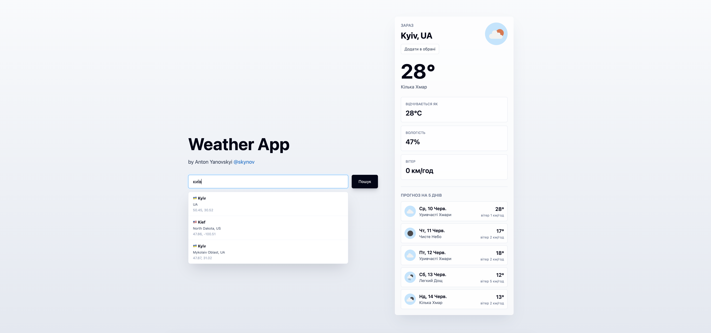

# Weather App

React + TypeScript застосунок для перегляду поточної погоди, прогнозу та збереження обраних міст.



## Demo

https://weather-app-xi-swart-70.vercel.app/

## Автор

[](https://github.com/skynovua)
[](https://www.linkedin.com/in/skynov/)

## Встановлення

```bash
pnpm install
```

## Налаштування

Створи `.env` у корені проєкту та додай ключ OpenWeather:

```bash
VITE_OPENWEATHER_API_KEY=your_api_key_here
```

Ключ можна отримати в OpenWeather API.

## Запуск

```bash
pnpm dev
```

Після запуску відкрий URL, який покаже Vite у терміналі.

## Команди

```bash
pnpm dev      # локальний dev server
pnpm build    # production build
pnpm lint     # перевірка ESLint
pnpm format   # форматування Prettier
pnpm preview  # перегляд production build
```
